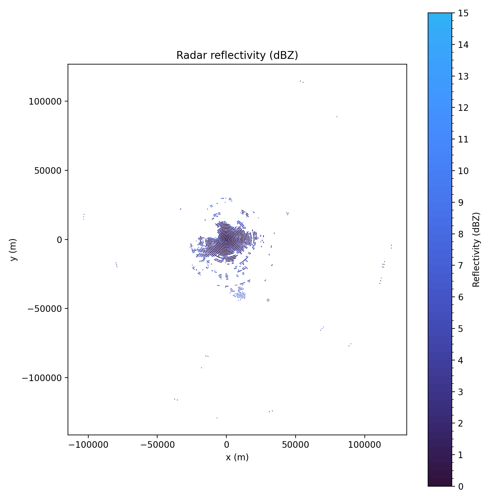

# Radar BUFR Data Extraction and Analysis (Météo-France) WIP

## Overview

This project focuses on the extraction, decoding, and preparation of **Météo-France weather radar data** distributed in **BUFR format**, with the long-term objective of enabling **machine learning–based anomaly detection** on radar products.

At this stage, the project is dedicated to:
- BUFR decoding **without eccodes**
- extraction of radar reflectivity and Doppler products
- storage of both raw and processed data
- preparation of clean, analyzable datasets

The ML modeling layer will be introduced in a later phase.

---

## Radar Data Description

found on météo-france api : [link](https://portail-api.meteofrance.fr/web/fr/api)

### Temporal and Station Organization

For each radar station (about 30 in France mainland and overseas):
- **3 BUFR files are produced every 15 minutes**
- Files correspond to PAM radar products, lightly processed radar data
- Data is station-centric and time-sliced

### Radar Products Used

This project currently processes:

- **PAM Reflectivity**
  - Horizontal reflectivity (dBZ)
  - Used to describe precipitation intensity and structure

- **PAM Doppler**
  - Radial velocity (m/s)
  - Used to analyze motion and non-meteorological targets

Other radar products are intentionally ignored at this stage.

---

## Why BUFR?

BUFR is the native operational format used by meteorological agencies:
- compact and efficient
- table-driven (WMO + local tables)
- capable of representing complex radar geometries

However:
- decoding requires **local BUFR tables**
- generic libraries (e.g. eccodes) are difficult to use without full table support
- documentation is sparse

This project therefore implements a **custom BUFR decoding pipeline**, focused strictly on the radar products of interest.

---

## Decoding Strategy

### Key Principles

- No use of `eccodes`
- Manual decoding based on:
  - WMO BUFR master tables
  - Météo-France local tables

### Reference Implementation

The BUFR decoding logic is mainly from :

https://github.com/theperk08/Meteo_France_Radars

This repository was essential to:
- understand Météo-France radar BUFR structures
- identify local descriptors
- validate scaling, reference values, and quantization

---

## Extraction and Parsing Pipeline

### 1. BUFR Ingestion

- Raw BUFR files are downloaded from api
- BUFR sections are decoded using loaded tables (CSV-based)
- Example of radar image generated from PAM file 

### 2. Radar Data Parsing

Depending on the product:
- Reflectivity:
  - pixel index → lookup table
  - conversion to physical units (dBZ)
- Doppler:
  - pixel index → lookup table
  - conversion to radial velocity (m/s)

Radar geometry should be preserved:
- azimuth index
- range gate index
- elevation angle

### 3. Point Generation

Decoded radar bins are converted into structured Python objects:
- one object per radar bin
- explicit typing (reflectivity vs doppler)
- generator-based processing to handle large volumes

### 4. Tabular Export

For inspection and downstream processing:
- radar points are converted into pandas DataFrames
- exported to CSV (temporary format)
- Parquet/Zarr planned for later stages

---

## Storage Architecture

### Object Storage (MinIO)

MinIO is used as the storage backend for:

- **Raw data**
  - Original BUFR files
  - Stored unchanged for traceability

- **Processed data**
  - CSV files
  - Future Parquet / feature datasets
  - Future ML-ready tensors

This separation ensures:
- reproducibility
- reprocessing capability
- clean data lineage

---

## Current Status

✔ BUFR decoding (manual, table-driven)  
✔ Reflectivity and Doppler parsing  
✔ Typed radar point generation  
✔ CSV export for inspection  
✔ Object storage via MinIO  

🚧 Machine learning models (planned)  
🚧 Feature engineering (planned)  
🚧 Anomaly detection (planned)

---

## Future Work

Planned next steps include:
- spatio-temporal feature extraction
- non-supervised anomaly detection
- discrimination of meteorological vs non-meteorological echoes
- optimized storage formats (Parquet ?)
- ML pipelines

---

## Disclaimer

This project is:
- experimental
- research-oriented
- not affiliated with Météo-France

It is intended for data analysis, experimentation, and learning purposes.

---
